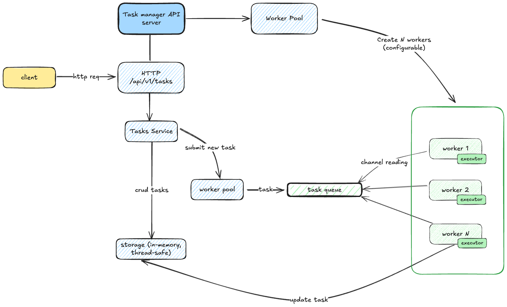

# Task Manager API

[](https://app.swaggerhub.com/apis-docs/YAROSLAV215/task-manager-api/1.0.0)
[](https://go.dev/)

HTTP-сервис для управления длительными I/O-задачами в памяти.
Позволяет создавать задачи, запрашивать их статус, удалять задачи и получать результаты.



## Требования

- Go 1.24 или выше
- git
- Taskfile (опционально)

## Установка и запуск

0. Склонировать репозиторий

    ```bash
    git clone https://github.com/passwordhash/task-manager-api
    ```

1. На основе `.env.example` создать файл `.env.local`

2. Установить зависимости

    ```bash
    go mod tidy
    ```

3. Запустить через Taskfile (при наличии)

    ```bash
    task run
    ```

    или вручную

    ```bash
    go run -race ./cmd/http_server/main.go -config=./configs/local.yml -io-duration=10s
    ```

## Запуск интеграционных тестов

_Для этого уже желательно использовать утилиту `Taskfile`_

1. Запуск приложения

    ```bash
    task run-for-tests
    ```

2. Далее в отдельной сессии терминала запустить тесты

    ```bash
    task func-tests
    ```

## Архитектура

### Основные компоненты

#### 1. HTTP Server (`internal/app/http`)

- Обработка HTTP-запросов
- Роутинг и middleware
- Graceful shutdown

#### 2. Task Service (`internal/service/task`)

- Бизнес-логика управления задачами
- Валидация и обработка ошибок
- Интеграция с worker pool и storage

#### 3. Worker Pool (`internal/worker/pool`)

- Пул воркеров для параллельного выполнения задач
- Управление очередью задач
- **Механизм отмены задач**

#### 4. Task Executor (`internal/worker/executor`)

- _Имитация I/O-операций_
- Настраиваемая продолжительность выполнения
- Обработка контекста и отмены

#### 5. In-Memory Storage (`internal/storage/inmemory`)

- _Потокобезопасное хранилище в памяти_
- CRUD операции для задач

#### 6. Domain Layer (`internal/domain`)

- Модель задачи
- Расчет продолжительности выполнения

### Поток выполнения

1. **Создание задачи**: HTTP запрос → Task Service → Storage → Worker Pool
2. **Выполнение**: Worker Pool → Task Queue → Worker → Executor
3. **Обновление статуса**: Worker → Storage
4. **Получение результата**: HTTP запрос → Task Service → Storage

### Куда развивать проект ?

- [ ] Сборка docker-образа (Dockerfile)
- [ ] Изменение хранилища на БД
- [ ] Настроить CI/CD
- [ ] Написать unit-тесты
